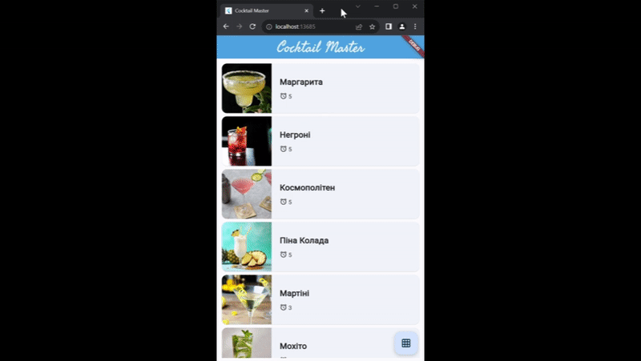
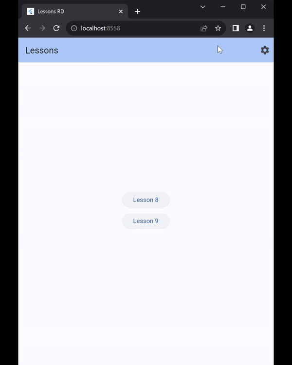
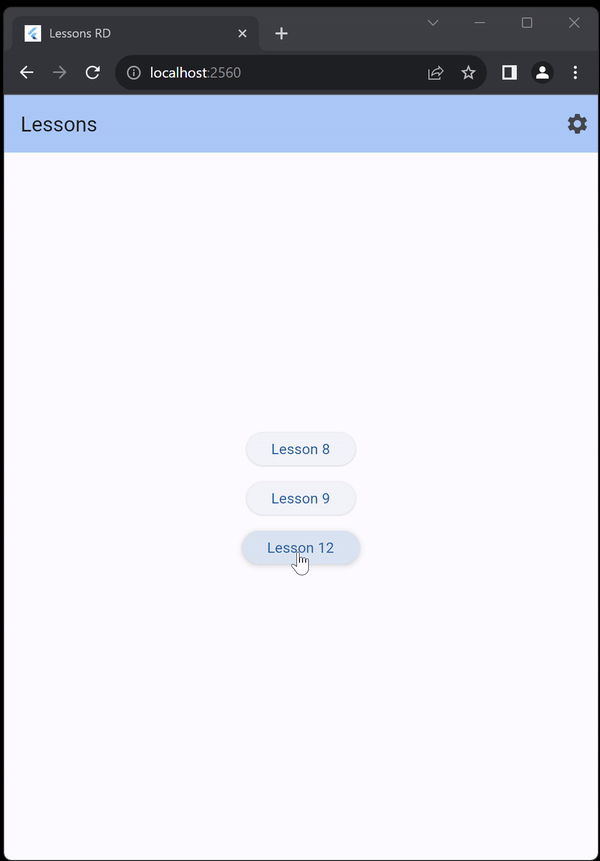
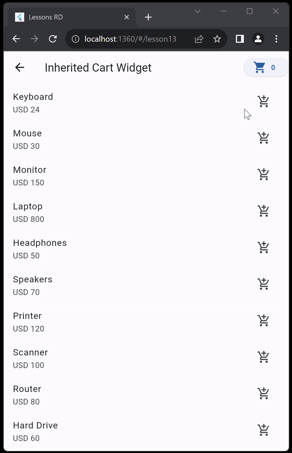
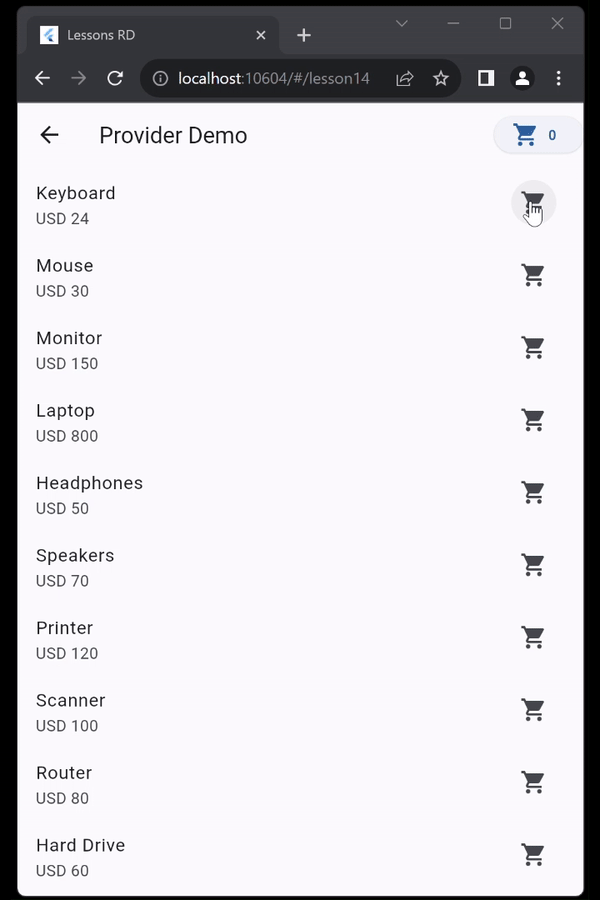

# RD Homework

1. Dart Classes *(homework_1/search_playlist.dart)*
 Playlist filtering

2. Lesson 8 Homework 
 
 
  
Cocktails recipe list

  
 

3. Lesson 9 Homework
 
 
  
Artworks list

  
 

4. Lesson 10 Homework
 
 
  
Settings

  
 

5. Lesson 12 Homework
 
 
  
Tasks

  
 

 6. Lesson 13 Homework
 
 
  
Inherited Widget

  
 

 7. Lesson 13 Homework
 
 
  
Provider

  
 
